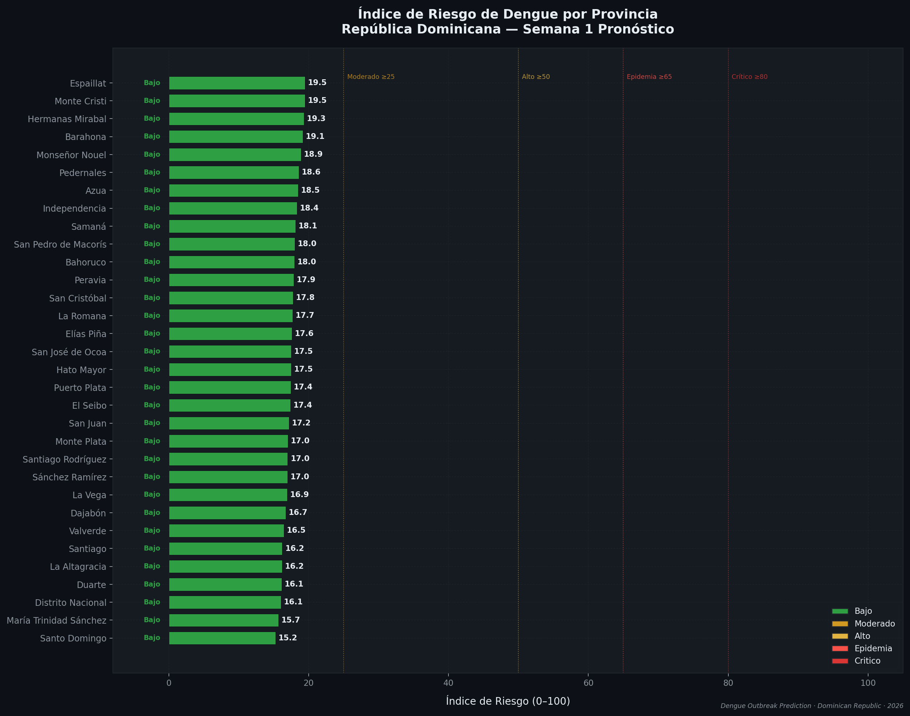
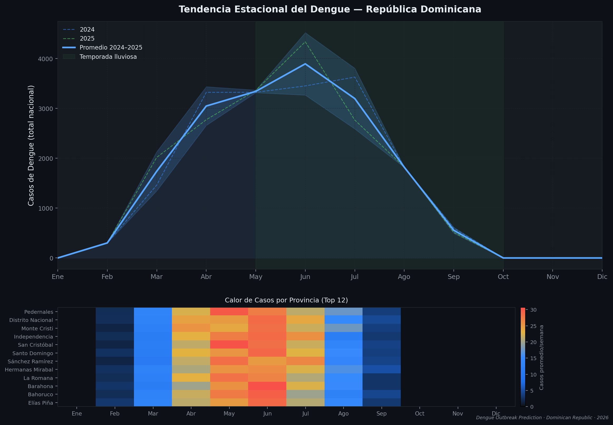
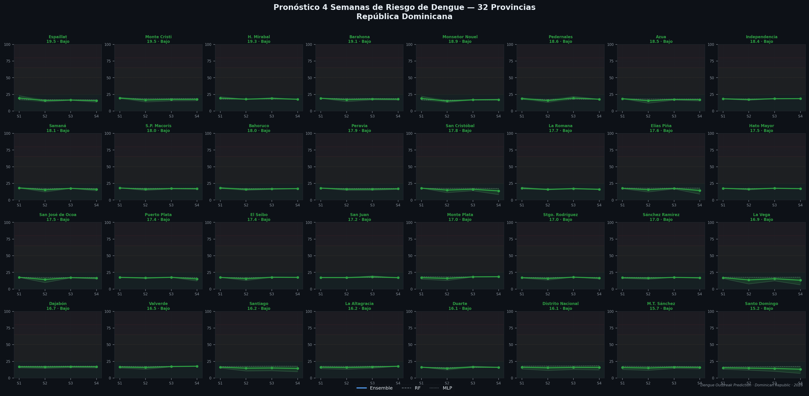
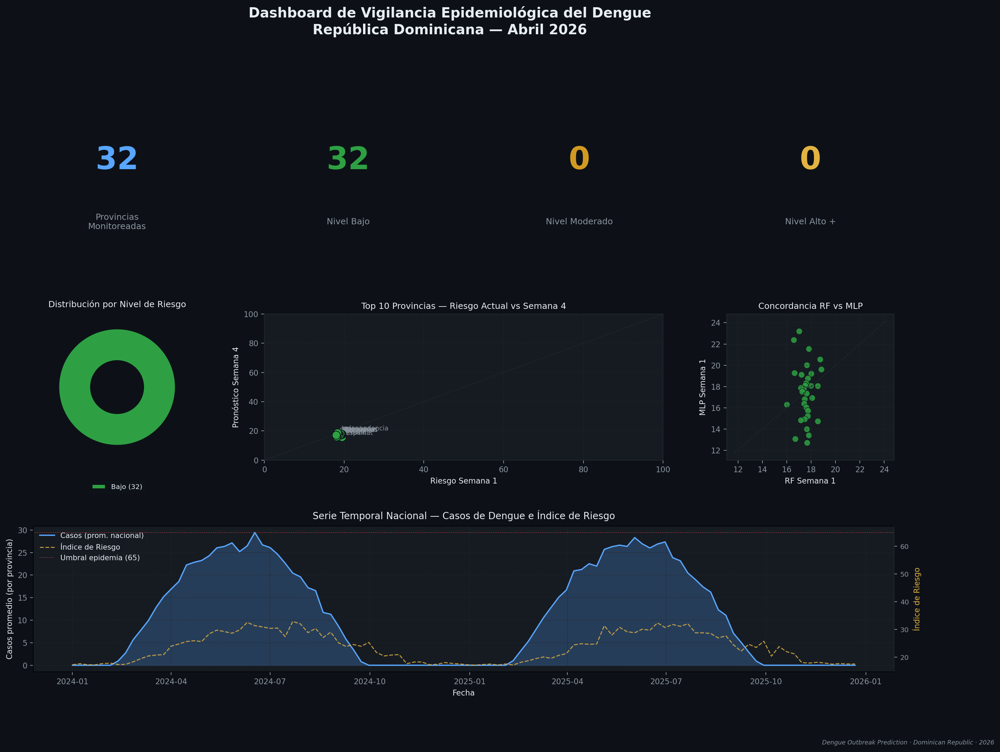

# 🦟 Dengue Outbreak Prediction System — Dominican Republic

<div align="center">


**An end-to-end AI system for dengue outbreak prediction across all 32 provinces of the Dominican Republic, powered by a Random Forest + MLP ensemble model.**

[English](#english) · [Español](#español)

</div>

---

<a name="english"></a>

## Description

This project delivers a full end-to-end dengue outbreak prediction system for the Dominican Republic, integrating:

- **Epidemiological and climate data** from PAHO/PAHO, ONAMET, ONE, and MSP-SINAVE
- **Ensemble model** — Random Forest (60%) + MLP regressor (40%)
- **4-week forecast** with a composite risk index 0–100 per province
- **REST API** with FastAPI for Power BI and external system integration
- **Interactive dashboard** with Streamlit and choropleth map
- **Weekly automation** for data ingestion and model retraining
- **AES-256 encryption** for sensitive epidemiological data

---

## Visualizations

### Province Risk Index — 4-Week Forecast


### Seasonal Dengue Trend


### 4-Week Forecast — All 32 Provinces


### Risk Surveillance Dashboard


---

## System Architecture

```
┌─────────────────────────────────────────────────────────────┐
│                      DATA SOURCES                           │
│  PAHO/PAHO  │  ONAMET  │  ONE (Census)  │  MSP-SINAVE      │
└────────────────────────┬────────────────────────────────────┘
                         ↓
┌─────────────────────────────────────────────────────────────┐
│                    DATA PIPELINE                            │
│  DataIngestion → DataPreprocessor → Feature Engineering     │
│  (lag features, rolling windows, normalization, sequences)  │
└────────────────────────┬────────────────────────────────────┘
                         ↓
┌─────────────────────────────────────────────────────────────┐
│                   ENSEMBLE MODEL                            │
│  ┌───────────────────┐    ┌──────────────────────────────┐  │
│  │  Random Forest    │    │  MLP Regressor               │  │
│  │  200 estimators   │    │  Sequence-based input        │  │
│  │  TimeSeriesSplit  │    │  Hidden layers: 256→128→64   │  │
│  │  Weight: 60%      │    │  Weight: 40%                 │  │
│  └─────────┬─────────┘    └──────────────┬───────────────┘  │
│            └──────────────┬──────────────┘                  │
│                   Weighted Ensemble                         │
│                Target accuracy: ≥ 88%                       │
└────────────────────────┬────────────────────────────────────┘
                         ↓
┌─────────────────────────────────────────────────────────────┐
│                    SYSTEM OUTPUTS                           │
│  FastAPI REST  │  Streamlit Dashboard  │  Encrypted CSV     │
│  Power BI      │  Email Alerts         │  Logs              │
└─────────────────────────────────────────────────────────────┘
```

---

## Installation

### Prerequisites

- Python 3.11+
- pip or conda
- Docker and Docker Compose (optional, for deployment)

### 1. Clone the repository

```bash
git clone https://github.com/your-username/dengue-outbreak-prediction-rd.git
cd dengue-outbreak-prediction-rd
```

### 2. Create a virtual environment

```bash
python -m venv venv

# Windows
venv\Scripts\activate

# Linux/Mac
source venv/bin/activate
```

### 3. Install dependencies

```bash
pip install -r requirements.txt
```

### 4. Configure environment variables

```bash
cp .env.example .env
# Edit with real values
nano .env   # or notepad .env on Windows
```

Critical variables:

```env
APP_PASSWORD=your_secure_password
ENCRYPTION_KEY=your_aes256_key
API_KEY_SECRET=your_api_key
EMAIL_USER=your@gmail.com
EMAIL_PASSWORD=your_app_password
EMAIL_TO_ALERTS=epidemiology@msp.gob.do
```

### 5. Generate dataset

```bash
python make_dataset.py
```

### 6. Train the model

```bash
python train.py
# Enter the password set in APP_PASSWORD / TRAIN_PASSWORD
```

### 7. Run predictions

```bash
python predict.py
# Exports Power BI-ready CSVs to outputs/
```

### 8. Start the API

```bash
python run_api.py
# API available at: http://localhost:8000
# Docs at:         http://localhost:8000/docs
```

### 9. Start the Dashboard

```bash
python run_dashboard.py
# Dashboard at: http://localhost:8501
```

---

## Docker (Full deployment)

```bash
cp .env.example .env
# Edit .env with real values

docker-compose -f docker/docker-compose.yml up -d
docker-compose -f docker/docker-compose.yml logs -f
docker-compose -f docker/docker-compose.yml down
```

| Service | URL |
|---------|-----|
| REST API | http://localhost:8000 |
| API Docs | http://localhost:8000/docs |
| Dashboard | http://localhost:8501 |

---

## REST API

All endpoints require the `X-API-Key` header.

#### `GET /predict/{province}` — Forecast for one province
```bash
curl -H "X-API-Key: your_api_key" \
  http://localhost:8000/predict/Santiago
```

**Response:**
```json
{
  "province": "Santiago",
  "current_risk_index": 68.5,
  "risk_level": "Epidemia",
  "forecast_4_weeks": {
    "week_1": 68.5,
    "week_2": 72.1,
    "week_3": 69.8,
    "week_4": 65.3
  },
  "peak_risk": 72.1,
  "peak_week": 2,
  "is_epidemic": true,
  "is_alert": false,
  "trend": "Ascendente"
}
```

#### `GET /provinces` — Summary for all provinces
```bash
curl -H "X-API-Key: your_api_key" http://localhost:8000/provinces
```

#### `GET /alerts` — Provinces in epidemic alert
```bash
curl -H "X-API-Key: your_api_key" "http://localhost:8000/alerts?threshold=65"
```

#### `POST /upload` — Upload new CSV data
```bash
curl -X POST -H "X-API-Key: your_api_key" \
  -F "file=@week_15_data.csv" \
  http://localhost:8000/upload
```

### Risk scale

| Level | Range | Color |
|-------|-------|-------|
| Low (Bajo) | 0 – 25 | 🟢 Green |
| Moderate (Moderado) | 25 – 50 | 🟡 Yellow |
| High (Alto) | 50 – 65 | 🟠 Orange |
| Epidemic (Epidemia) | 65 – 80 | 🔴 Red |
| Critical (Crítico) | 80 – 100 | ⚫ Dark red |

---

## Connect Power BI

1. Open Power BI Desktop
2. **Get Data** → **Web**
3. URL: `http://localhost:8000/provinces`
4. **Advanced settings** → HTTP headers:
   - Name: `X-API-Key`
   - Value: your API key from .env
5. **OK** → **Transform Data** → expand the `predictions` column
6. Load and build visuals

---

## Methodology

### Model features

**Climate:** rainfall (mm), max/min/avg temperature (°C), relative humidity (%), wind speed (km/h), ENSO index

**Epidemiological:** confirmed cases weeks 1–4 prior, annual cumulative cases, incidence rate per 100,000

**Demographic:** population, density (pop/km²), urban %, poverty index, sanitation index

**Feature engineering:** lag features (1, 2, 3, 4, 8, 12 weeks), rolling mean & std (4, 8, 12 weeks), cyclic features (week sin/cos, month sin/cos), rainy season flag

### Ensemble architecture

**Random Forest (60%):** 200 estimators, max_depth=15, multi-output (predicts all 4 weeks simultaneously), validated with TimeSeriesSplit (5 folds)

**MLP Regressor (40%):** Sequence input (12 weeks × 69 features), architecture 828→256→128→64→4, ReLU activations

**Composite risk index:** 40% epidemiological incidence + 25% accumulated rainfall + 20% average temperature + 10% relative humidity + 5% poverty index

---

## Security

- **AES-256-CBC** encryption with HMAC-SHA256 for all data files
- **PBKDF2 key derivation** with 100,000 iterations
- **API Key authentication** on all REST endpoints
- **Access password** required before training scripts execute
- **Environment variables** for all credentials (never in source code)
- `.gitignore` excludes raw data, trained models, `.env`, and outputs

---

## Automation

| Task | Schedule | Description |
|------|----------|-------------|
| Data download | Monday 6:00 AM | PAHO + ONAMET + ONE |
| Model check | Monday 8:00 AM | Retrains if accuracy < 88% |
| Export | Monday 10:00 AM | Encrypted CSV for Power BI |
| Alert check | Every 6 hours | Email if province exceeds threshold |
| Health check | Every hour | System status |

---

## Tests

```bash
pytest
pytest --cov=src --cov=api --cov-report=html
pytest tests/test_encryption.py -v
pytest tests/test_model.py -v
pytest tests/test_api.py -v
```

Target coverage: **≥ 75%**

---

## Project Structure

```
dengue-outbreak-prediction-rd/
├── config/                 # Centralized configuration
│   └── settings.py         # Env vars + constants
├── src/
│   ├── data/
│   │   ├── ingestion.py    # Downloads from PAHO, ONAMET, ONE
│   │   └── preprocessing.py # Cleaning, lag features, normalization
│   ├── models/
│   │   ├── random_forest.py # Multi-output RF model
│   │   ├── lstm.py          # MLP sequence model (TF fallback)
│   │   ├── ensemble.py      # Weighted RF+MLP combination
│   │   └── trainer.py       # Training pipeline
│   ├── security/
│   │   └── encryption.py    # AES-256 + authentication
│   └── utils/
│       ├── logger.py        # Loguru logging system
│       └── helpers.py       # General utilities
├── api/
│   ├── main.py             # FastAPI main app
│   ├── auth.py             # API Key authentication
│   ├── schemas.py          # Pydantic models
│   └── routers/
│       ├── predictions.py   # GET /predict/{province}
│       ├── provinces.py     # GET /provinces
│       ├── alerts.py        # GET /alerts
│       └── upload.py        # POST /upload
├── app/
│   └── streamlit_app.py    # Interactive dashboard
├── scheduler/
│   ├── weekly_scheduler.py # APScheduler jobs
│   ├── jobs.py             # Job functions
│   └── alerts.py           # Email alert system
├── tests/
│   ├── conftest.py         # Shared fixtures
│   ├── test_encryption.py
│   ├── test_model.py
│   └── test_api.py
├── docker/
│   ├── Dockerfile
│   ├── docker-compose.yml
│   └── nginx.conf
├── notebooks/
│   └── 01_EDA_Dengue_RD.ipynb
├── data/raw/               # Raw data (gitignored)
├── models/                 # Trained models (gitignored)
├── outputs/                # Prediction CSVs (gitignored)
├── visuals/                # Exported charts
├── make_dataset.py         # Synthetic dataset generator
├── predict.py              # Inference script → outputs/
├── train.py                # Training script
├── generate_visuals.py     # Chart generation script
├── run_api.py
└── run_dashboard.py
```

---

## Data Dictionary

| Variable | Type | Description | Source |
|----------|------|-------------|--------|
| province | str | Province name | ONE |
| year | int | Epidemiological year | — |
| week | int | Epidemiological week (1–53) | — |
| cases | int | Confirmed dengue cases | MSP-SINAVE |
| deaths | int | Dengue deaths | MSP-SINAVE |
| rainfall_mm | float | Weekly rainfall in mm | ONAMET |
| temp_max_c | float | Maximum temperature °C | ONAMET |
| temp_min_c | float | Minimum temperature °C | ONAMET |
| temp_avg_c | float | Average temperature °C | ONAMET |
| humidity_pct | float | Average relative humidity % | ONAMET |
| wind_speed_kmh | float | Wind speed km/h | ONAMET |
| enso_index | float | ENSO index (ONI) | NOAA |
| population | int | Total province population | ONE |
| population_density_km2 | float | Pop density hab/km² | ONE |
| urban_pct | float | Urban population % | ONE |
| poverty_index | float | Poverty index % | ONE |
| sanitation_index | float | Sanitation index (0–100) | ONE |
| incidence_rate_100k | float | Cases per 100,000 inhabitants | Calculated |
| outbreak_risk_index | float | Composite risk index 0–100 (target) | Calculated |

---

## Data Sources

| Source | Data | Frequency |
|--------|------|-----------|
| PAHO/OPS | Weekly dengue cases by country | Weekly |
| ONAMET | Rainfall, temperature, humidity | Daily |
| ONE | Demographics, 32-province census | Annual |
| MSP-DIGEPI | Epidemiological bulletins | Weekly |
| NOAA | ENSO index (ONI) | Monthly |

---

## Contributing

1. Fork the repository
2. Create a feature branch: `git checkout -b feature/new-feature`
3. Commit your changes: `git commit -m "Add new feature"`
4. Push to the branch: `git push origin feature/new-feature`
5. Open a Pull Request

---

## License

MIT License — See [LICENSE](LICENSE) for details.

---

<a name="español"></a>

# 🦟 Sistema de Predicción de Brotes de Dengue — República Dominicana

<div align="center">


**Sistema de inteligencia artificial para predicción de brotes de dengue en las 32 provincias de la República Dominicana, usando ensemble de modelos Machine Learning (Random Forest + MLP).**

</div>

---

## Descripción

Este proyecto desarrolla un sistema end-to-end de predicción de brotes de dengue para la República Dominicana, integrando:

- **Datos reales** de PAHO/OPS, ONAMET, ONE y MSP-SINAVE
- **Modelo ensemble** Random Forest (60%) + MLP regresor (40%)
- **Pronóstico a 4 semanas** con índice de riesgo 0–100 por provincia
- **API REST** con FastAPI para integración con Power BI y sistemas externos
- **Dashboard interactivo** con Streamlit y mapa coroplético
- **Automatización semanal** de descarga de datos y re-entrenamiento
- **Cifrado AES-256** para protección de datos epidemiológicos sensibles

---

## Visualizaciones

### Índice de Riesgo por Provincia — Pronóstico Semana 1


### Tendencia Estacional del Dengue


### Pronóstico 4 Semanas — 32 Provincias


### Dashboard de Vigilancia Epidemiológica


---

## Arquitectura del Sistema

```
┌─────────────────────────────────────────────────────────────┐
│                    FUENTES DE DATOS                         │
│  PAHO/OPS  │  ONAMET  │  ONE (Censo)  │  MSP-SINAVE        │
└────────────────────────┬────────────────────────────────────┘
                         ↓
┌─────────────────────────────────────────────────────────────┐
│               PIPELINE DE DATOS                             │
│  DataIngestion → DataPreprocessor → Feature Engineering     │
│  (lag features, rolling windows, normalización, secuencias) │
└────────────────────────┬────────────────────────────────────┘
                         ↓
┌─────────────────────────────────────────────────────────────┐
│                   MODELO ENSEMBLE                           │
│  ┌───────────────────┐    ┌──────────────────────────────┐  │
│  │  Random Forest    │    │  MLP Regresor                │  │
│  │  200 estimadores  │    │  Entrada secuencial          │  │
│  │  TimeSeriesSplit  │    │  Capas: 256→128→64           │  │
│  │  Peso: 60%        │    │  Peso: 40%                   │  │
│  └─────────┬─────────┘    └──────────────┬───────────────┘  │
│            └──────────────┬──────────────┘                  │
│                     Ensemble Ponderado                      │
│               Accuracy objetivo: ≥ 88%                     │
└────────────────────────┬────────────────────────────────────┘
                         ↓
┌─────────────────────────────────────────────────────────────┐
│         SALIDAS DEL SISTEMA                                 │
│  FastAPI REST  │  Streamlit Dashboard  │  CSV Cifrado       │
│  Power BI      │  Email Alertas        │  Logs              │
└─────────────────────────────────────────────────────────────┘
```

---

## Instalación

### Requisitos previos

- Python 3.11+
- pip o conda
- Docker y Docker Compose (opcional, para despliegue)

### 1. Clonar el repositorio

```bash
git clone https://github.com/tu-usuario/dengue-outbreak-prediction-rd.git
cd dengue-outbreak-prediction-rd
```

### 2. Crear entorno virtual

```bash
python -m venv venv

# Windows
venv\Scripts\activate

# Linux/Mac
source venv/bin/activate
```

### 3. Instalar dependencias

```bash
pip install -r requirements.txt
```

### 4. Configurar variables de entorno

```bash
cp .env.example .env
nano .env   # o notepad .env en Windows
```

Variables críticas:

```env
APP_PASSWORD=tu_password_seguro
ENCRYPTION_KEY=tu_clave_aes256
API_KEY_SECRET=tu_api_key
EMAIL_USER=tu@gmail.com
EMAIL_PASSWORD=tu_app_password
EMAIL_TO_ALERTS=epidemiologia@msp.gob.do
```

### 5. Generar dataset

```bash
python make_dataset.py
```

### 6. Entrenar el modelo

```bash
python train.py
# Ingrese la contraseña configurada en APP_PASSWORD / TRAIN_PASSWORD
```

### 7. Generar predicciones

```bash
python predict.py
# Exporta CSVs listos para Power BI a outputs/
```

### 8. Iniciar la API

```bash
python run_api.py
# API disponible en: http://localhost:8000
# Documentación en: http://localhost:8000/docs
```

### 9. Iniciar el Dashboard

```bash
python run_dashboard.py
# Dashboard en: http://localhost:8501
```

---

## Docker (Despliegue completo)

```bash
cp .env.example .env
# Editar .env con valores reales

docker-compose -f docker/docker-compose.yml up -d
docker-compose -f docker/docker-compose.yml logs -f
docker-compose -f docker/docker-compose.yml down
```

| Servicio | URL |
|----------|-----|
| API REST | http://localhost:8000 |
| Documentación API | http://localhost:8000/docs |
| Dashboard | http://localhost:8501 |

---

## API REST

Todos los endpoints requieren el header `X-API-Key`.

#### `GET /predict/{province}` — Predicción por provincia
```bash
curl -H "X-API-Key: tu_api_key" \
  http://localhost:8000/predict/Santiago
```

**Respuesta:**
```json
{
  "province": "Santiago",
  "current_risk_index": 68.5,
  "risk_level": "Epidemia",
  "forecast_4_weeks": {
    "week_1": 68.5,
    "week_2": 72.1,
    "week_3": 69.8,
    "week_4": 65.3
  },
  "peak_risk": 72.1,
  "peak_week": 2,
  "is_epidemic": true,
  "is_alert": false,
  "trend": "Ascendente"
}
```

#### `GET /provinces` — Resumen todas las provincias
```bash
curl -H "X-API-Key: tu_api_key" http://localhost:8000/provinces
```

#### `GET /alerts` — Provincias en alerta epidémica
```bash
curl -H "X-API-Key: tu_api_key" "http://localhost:8000/alerts?threshold=65"
```

#### `POST /upload` — Cargar nuevos datos CSV
```bash
curl -X POST -H "X-API-Key: tu_api_key" \
  -F "file=@datos_semana_15.csv" \
  http://localhost:8000/upload
```

### Escalas de riesgo

| Nivel | Rango | Color |
|-------|-------|-------|
| Bajo | 0 – 25 | 🟢 Verde |
| Moderado | 25 – 50 | 🟡 Amarillo |
| Alto | 50 – 65 | 🟠 Naranja |
| Epidemia | 65 – 80 | 🔴 Rojo |
| Crítico | 80 – 100 | ⚫ Rojo oscuro |

---

## Conectar Power BI

1. Abrir Power BI Desktop
2. **Obtener datos** → **Web**
3. URL: `http://localhost:8000/provinces`
4. **Configuración avanzada** → Headers HTTP:
   - Nombre: `X-API-Key`
   - Valor: tu clave API del .env
5. **Aceptar** → **Transformar datos** → expandir campo `predictions`
6. Cargar y crear visualizaciones

---

## Metodología

### Variables del modelo

**Climáticas:** precipitación (mm), temperatura máx/mín/prom (°C), humedad relativa (%), velocidad del viento (km/h), índice ENSO

**Epidemiológicas:** casos confirmados semanas 1–4 previas, acumulado anual, tasa de incidencia por 100,000 hab.

**Demográficas:** población, densidad (hab/km²), % urbano, índice de pobreza, índice de saneamiento

**Ingeniería de features:** lag features (1, 2, 3, 4, 8, 12 semanas), rolling mean y std (4, 8, 12 semanas), features cíclicas (semana sin/cos, mes sin/cos), bandera temporada lluviosa

### Arquitectura del ensemble

**Random Forest (60%):** 200 estimadores, max_depth=15, multi-output (4 semanas simultáneas), validación TimeSeriesSplit (5 folds)

**MLP Regresor (40%):** entrada secuencial (12 semanas × 69 features), arquitectura 828→256→128→64→4, activaciones ReLU

**Índice de riesgo compuesto:** 40% tasa de incidencia + 25% lluvia acumulada + 20% temperatura promedio + 10% humedad relativa + 5% índice de pobreza

---

## Seguridad

- **Cifrado AES-256-CBC** con HMAC-SHA256 para todos los archivos de datos
- **Derivación de clave PBKDF2** con 100,000 iteraciones
- **API Key authentication** en todos los endpoints REST
- **Contraseña de acceso** requerida antes de ejecutar entrenamiento
- **Variables de entorno** para todas las credenciales (nunca en el código)
- `.gitignore` excluye datos crudos, modelos, `.env` y outputs

---

## Automatización

| Tarea | Horario | Descripción |
|-------|---------|-------------|
| Descarga de datos | Lunes 6:00 AM | PAHO + ONAMET + ONE |
| Verificación de modelo | Lunes 8:00 AM | Re-entrena si accuracy < 88% |
| Exportación | Lunes 10:00 AM | CSV cifrado para Power BI |
| Verificación alertas | Cada 6 horas | Email si provincia supera umbral |
| Health check | Cada hora | Estado del sistema |

---

## Tests

```bash
pytest
pytest --cov=src --cov=api --cov-report=html
pytest tests/test_encryption.py -v
pytest tests/test_model.py -v
pytest tests/test_api.py -v
```

Cobertura objetivo: **≥ 75%**

---

## Estructura del Proyecto

```
dengue-outbreak-prediction-rd/
├── config/                 # Configuración centralizada
│   └── settings.py
├── src/
│   ├── data/
│   │   ├── ingestion.py    # Descarga desde PAHO, ONAMET, ONE
│   │   └── preprocessing.py
│   ├── models/
│   │   ├── random_forest.py
│   │   ├── lstm.py          # MLP regresor (fallback sin TF)
│   │   ├── ensemble.py
│   │   └── trainer.py
│   ├── security/
│   │   └── encryption.py    # Cifrado AES-256
│   └── utils/
│       ├── logger.py
│       └── helpers.py
├── api/
│   ├── main.py
│   ├── auth.py
│   ├── schemas.py
│   └── routers/
├── app/
│   └── streamlit_app.py
├── scheduler/
├── tests/
├── docker/
├── notebooks/
├── data/raw/               # Datos crudos (gitignored)
├── models/                 # Modelos entrenados (gitignored)
├── outputs/                # CSVs de predicciones (gitignored)
├── visuals/                # Gráficos exportados
├── make_dataset.py
├── predict.py
├── train.py
├── generate_visuals.py
├── run_api.py
└── run_dashboard.py
```

---

## Diccionario de Datos

| Variable | Tipo | Descripción | Fuente |
|----------|------|-------------|--------|
| province | str | Nombre de la provincia | ONE |
| year | int | Año epidemiológico | — |
| week | int | Semana epidemiológica (1–53) | — |
| cases | int | Casos confirmados de dengue | MSP-SINAVE |
| deaths | int | Muertes por dengue | MSP-SINAVE |
| rainfall_mm | float | Precipitación semanal en mm | ONAMET |
| temp_max_c | float | Temperatura máxima en °C | ONAMET |
| temp_min_c | float | Temperatura mínima en °C | ONAMET |
| temp_avg_c | float | Temperatura promedio en °C | ONAMET |
| humidity_pct | float | Humedad relativa promedio % | ONAMET |
| wind_speed_kmh | float | Velocidad del viento km/h | ONAMET |
| enso_index | float | Índice ENSO (ONI) | NOAA |
| population | int | Población total de la provincia | ONE |
| population_density_km2 | float | Densidad hab/km² | ONE |
| urban_pct | float | % de población urbana | ONE |
| poverty_index | float | Índice de pobreza % | ONE |
| sanitation_index | float | Índice de saneamiento (0–100) | ONE |
| incidence_rate_100k | float | Casos por 100,000 habitantes | Calculado |
| outbreak_risk_index | float | Índice de riesgo 0–100 (target) | Calculado |

---

## Fuentes de Datos

| Fuente | Datos | Frecuencia |
|--------|-------|-----------|
| PAHO/OPS | Casos semanales de dengue | Semanal |
| ONAMET | Precipitación, temperatura, humedad | Diaria |
| ONE | Demografía, censo 32 provincias | Anual |
| MSP-DIGEPI | Boletines epidemiológicos | Semanal |
| NOAA | Índice ENSO (ONI) | Mensual |

---

## Contribuciones

1. Haga fork del repositorio
2. Cree una rama: `git checkout -b feature/nueva-funcionalidad`
3. Commit sus cambios: `git commit -m "Agrega nueva funcionalidad"`
4. Push: `git push origin feature/nueva-funcionalidad`
5. Abra un Pull Request

---

## Contacto y Contexto

Sistema desarrollado como herramienta de apoyo a la vigilancia epidemiológica de dengue en la República Dominicana. Los datos reales requieren acceso institucional a PAHO, ONAMET, ONE y MSP-DIGEPI.

Para uso institucional o académico: consulte con la Dirección General de Epidemiología (DIGEPI) del Ministerio de Salud Pública de la República Dominicana.

---

## Licencia

MIT License — Ver archivo [LICENSE](LICENSE) para detalles.

---

<div align="center">
<p>Developed for epidemiological surveillance of dengue in the Dominican Republic</p>
<p>Desarrollado para la vigilancia epidemiológica de la República Dominicana</p>
<p>Data / Datos: PAHO · ONAMET · ONE · MSP-DIGEPI · NOAA</p>
</div>
